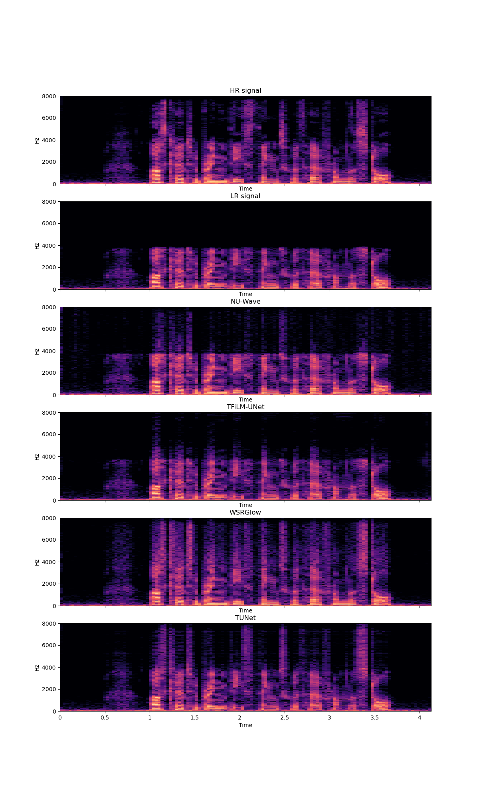

# TUNet - Official Implementation

**TUNet: A Block-online Bandwidth Extension Model based on Transformers and Self-supervised Pretraining - ICASSP 2022**


[](https://arxiv.org/abs/2110.13492)
[](https://paperswithcode.com/sota/audio-super-resolution-on-vctk-multi-speaker-1?p=tunet-a-block-online-bandwidth-extension)
[](https://github.com/NXTProduct/TUNet/)
[](https://github.com/NXTProduct/TUNet/commits)
## License and citation
This code is available for academic research only. If you use our software, please cite as below.
For commercial applications, please contact [nxt.sales@fsoft.com.vn](mailto:nxt.sales@fsoft.com.vn).

Copyright © 2021 FPT Software, Inc. All rights reserved.

```
@inproceedings{Nguyen_2022,
	doi = {10.1109/icassp43922.2022.9747699},
	url = {https://doi.org/10.1109%2Ficassp43922.2022.9747699},
	year = 2022,
	month = {may},
	publisher = {{IEEE}},
	author = {Viet-Anh Nguyen and Anh H. T. Nguyen and Andy W. H. Khong},
	title = {{TUNet}: A Block-Online Bandwidth Extension Model Based On Transformers And Self-Supervised Pretraining},
	booktitle = {{ICASSP} 2022 - 2022 {IEEE} International Conference on Acoustics, Speech and Signal Processing ({ICASSP})}
}
```

# 1. Results
Our model achieved a significant gain over baselines. Here, we include the predicted mean-opion-score (MOS) using Microsoft's [DNSMOS](https://github.com/microsoft/DNS-Challenge/tree/master/DNSMOS) Azure service. Please refer to our paper for more benchmarks.

| Model | DNSMOS | 
| -------- | -------- |
|Input     | 3.0951   | 
|TFiLM-UNet     | 3.1026   | 
|WSRGlow     | 3.2053   | 
|NU-Wave     | 3.2760   | 
|TUNet     | **3.3896**|

We also provide several audio samples in [audio_samples](audio_samples) for comparison. In spectrogram visualization, it can be seen that high frequencies generated by our models are more accurate than the baselines.




# 2. Installation

## Setup

### Clone the repo

```
$ git clone https://github.com/NXTProduct/TUNet.git
$ cd TUNet
```

### Install dependencies

* Our implementation requires the `libsndfile` and `libsamplerate` libraries for the Python packages `soundfile`
  and `samplerate`, respectively. On Ubuntu, they can be easily installed using `apt-get`:
    ```
    $ apt-get update && apt-get install libsndfile-dev libsamplerate-dev
    ```
* Create a Python 3.8 environment. Conda is recommended:
   ```
   $ conda create -n tunet python=3.8
   $ conda activate tunet
   ```

* Install the requirements:
    ```
    $ pip install -r requirements.txt -f https://download.pytorch.org/whl/cu113/torch_stable.html
    ```

**Note**: the argument `-f https://download.pytorch.org/whl/cu113/torch_stable.html` is provided to
install `torch==1.10.0+cu113`  (Pytorch 1.10, CUDA 11.3) inside the `requirements.txt` . Choose an appropriate CUDA
version to your GPUs and change/remove the argument according
to [PyTorch documentation](https://pytorch.org/get-started/locally/)

# 3. Data preparation

In our paper, we conduct experiments on the [VCTK](https://datashare.ed.ac.uk/handle/10283/3443)
and [VIVOS](https://ailab.hcmus.edu.vn/vivos) datasets. You may use either one or both.

* Download and extract the datasets:
    ```
    $ wget http://www.udialogue.org/download/VCTK-Corpus.tar.gz -O data/vctk/VCTK-Corpus.tar.gz
    $ wget https://ailab.hcmus.edu.vn/assets/vivos.tar.gz -O data/vivos/vivos.tar.gz
    $ tar -zxvf data/vctk/VCTK-Corpus.tar.gz -C data/vctk/ --strip-components=1
    $ tar -zxvf data/vivos/vivos.tar.gz -C data/vivos/ --strip-components=1
    ```

  After extracting the datasets, your `./data` directory should look like this:

    ```
    .
    |--data
        |--vctk
            |--wav48
                |--p225
                    |--p225_001.wav
                    ...
            |--train.txt   
            |--test.txt
        |--vivos
            |--train
                |--waves
                    |--VIVOSSPK01
                        |--VIVOSSPK12_R001.wav
                        ...                
            |--test
                |--waves
                    |--VIVOSDEV01
                        |--VIVOSDEV01_R001.wav
                        ...      
            |--train.txt   
            |--test.txt
    ```
* In order to load the datasets, text files that contain training and testing audio paths are required. We have
  prepared `train.txt` and `test.txt` files in `./data/vctk` and `./data/vivos` directories.

# 4. Run the code

## Configuration

`config.py` is the most important file. Here, you can find all the configurations related to experiment setups,
datasets, models, training, testing, etc. Although the config file has been explained thoroughly, we recommend reading
our paper to fully understand each parameter.

## Training

* Adjust training hyperparameters in `config.py`

  **Note:** `batch_size` in this implementation is different from the batch size in the paper. Specifically, we infer "
  batch size" in our paper as the number of **frames** per batch, whereas in this repo, `batch_size` is the number of **
  audio files** per batch. The DataLoader loads batches of audio files then chunks into frames on the fly. Since audio
  duration is variable, the number of frames per batch varies around 12*`batch_size` .
* Run `main.py`:
    ```
    $ python main.py --mode train
    ```
* Each run will create a version in `./lightning_logs`, where the model checkpoint and hyperparameters are saved. In
  case you want to continue training from one of these versions, just set the argument `--version` of the above command
  to your desired version number. For example:
    ```
    # resume from version 5
    $ python main.py --mode train --version 5
    ```
* To monitor the training curves as well as inspect model output visualization, run the tensorboard:
    ```
    $ tensorboard --logdir=./lightning_logs --bind_all
    ```
  
  

## Evaluation

* Modify `config.py` to change evaluation setup if necessary.
* Run `main.py` with a version number to be evaluated:
    ```
    $ python main.py --mode eval --version 5
    ```
  This will give the mean and standard deviation of LSD, LSD-HF, and SI-SDR, respectively. During the evaluation,
  several output samples are saved to `CONFIG.LOG.sample_path` for sanity testing.

## Configure a new dataset

Our implementation currently works with the VCTK and VIVOS datasets but can be easily extensible to a new one.

* Firstly, you need to prepare `train.txt` and `test.txt`. See `./data/vivos/train.txt` and `./data/vivos/test.txt` for
  example.
* Secondly, add a new dictionary to `CONFIG.DATA.data_dir`:
    ```
    {
    'root': 'path/to/data/directory',
    'train': 'path/to/train.txt',
    'test': 'path/to/test.txt'
    }
    ```
  **Important:** Make sure each line in `train.txt` and `test.txt` joining with `'root'` is a valid path to its
  corresponding audio file.
  
# 5. Audio generation

* In order to generate output audios, you need to either put your input samples into `./test_samples` or
  modify `CONFIG.TEST.in_dir` to your input directory.
* Run `main.py`:
    ```
    python main.py --mode test --version 5
    ```
  The generated audios are saved to `CONFIG.TEST.out_dir`.
  
  **Note:** checkpoint `version_5` has only been trained for a few epochs for demonstration purposes. Since the code has been refactored, the checkpoint we used in the paper could not be loaded. To inference with our best checkpoint, please use the ONNX model instead.
  ## ONNX inferencing
  We provide ONNX inferencing scripts and the best ONNX model (converted from the best checkpoint) at `lightning_logs/best_model.onnx`.
  * Convert a checkpoint to an ONNX model:
      ```
      python main.py --mode onnx --version 5
      ```
    The converted ONNX model will be saved to `lightning_logs/version_5/checkpoints`.
  * Put test audios in `test_samples` and inference with the converted ONNX model (see `inference_onnx.py` for more details):
       ```
      python inference_onnx.py
      ```

# 6. Acknowledgement
We thank FPT Software for funding and providing GPU infrastructure. 
We also thank Microsoft for giving access to the DNSMOS Azure service. 
